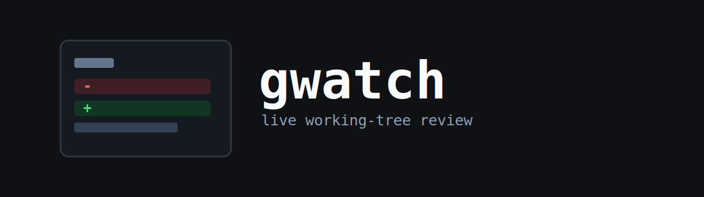

<p align="center">
  
</p>

<p align="center">
  <a href="https://github.com/connorcarro/gwatch/actions/workflows/ci.yml"></a>
  <a href="https://www.rust-lang.org"></a>
  <a href="LICENSE"></a>
</p>

<h1 align="center">gwatch</h1>

Read-only realtime terminal UI for reviewing Git working-tree changes.

`gwatch` is built for the moment when files are changing quickly and `git status`
plus repeated `git diff` calls stop being enough. It opens a terminal dashboard
that continuously shows staged, unstaged, deleted, renamed, and untracked files,
with an inline diff preview for the selected path.

It is intentionally narrow: `gwatch` does not stage files, create commits,
checkout branches, or mutate your repository. It watches the working tree,
asks Git for status and diff data, and renders that information in a fast TUI.

## Contents

- [Why gwatch](#why-gwatch)
- [Requirements](#requirements)
- [Installation](#installation)
- [Usage](#usage)
- [Features](#features)
- [Controls](#controls)
- [How It Works](#how-it-works)
- [Development](#development)
- [Project Structure](#project-structure)
- [Testing Helpers](#testing-helpers)
- [Troubleshooting](#troubleshooting)
- [License](#license)

## Why gwatch

Use `gwatch` when you want a live, read-only view of code changes without
leaving the terminal.

Common workflows:

- monitor edits from another terminal, script, editor, or AI coding agent
- keep a live diff open while reviewing generated or fast-moving changes
- inspect untracked files without opening each file manually
- focus on files touched during the current watch session
- review very large diffs without loading the entire rendered view into memory

Traditional Git TUIs are usually designed around performing Git operations.
`gwatch` is designed around situational awareness.

## Requirements

- Git must be installed and available on `PATH`.
- `gwatch` must run inside a Git working tree, or you must pass `--repo`.
- The target directory must be part of a Git repository.
- Rust 1.85 or newer is required when building from source.

`gwatch` relies on Git as the source of truth. File watching tells the app when
something changed, but Git provides the repository root, branch name, file
statuses, rename detection, numstat summaries, and unified diffs.

If you run `gwatch` outside a Git repository, it cannot compute a working-tree
diff and will fail with a repository discovery error. Start it from inside a
repository or provide an explicit path:

```powershell
gwatch --repo C:\path\to\repo
```

## Installation

### Install From Source

```powershell
cargo install --path .
```

### Run From Source

```powershell
cargo run -- --repo C:\path\to\repo
```

### Windows Helper

This repository includes a Windows install helper:

```powershell
.\scripts\install.ps1
```

The helper checks for the common Windows linker conflict where Rust accidentally
finds Git for Windows' `link.exe` instead of the Microsoft linker.

## Usage

Start `gwatch` from inside a Git repository:

```powershell
gwatch
```

Or watch a repository from anywhere:

```powershell
gwatch --repo C:\path\to\repo
```

When there are no working-tree changes, the file list shows
`No working-tree changes`. Add, edit, delete, rename, stage, or unstage files and
the view will refresh automatically.

## Features

- realtime working-tree monitoring with filesystem events and debounced refreshes
- read-only Git integration for status, numstat, branch, and unified diff data
- staged, unstaged, deleted, renamed, and untracked file visibility
- changed-file list with status badges, added/deleted counts, recent markers, and
  session-change markers
- inline colored diffs with old/new line number gutters
- syntax highlighting powered by `syntect`
- split view and full-width diff view
- filtering, sorting, pinning, hunk navigation, mouse support, and line wrapping
- current-session scope for hiding changes that existed before `gwatch` started
- large-diff support using disk-backed diff documents and viewport-based rendering
- lazy untracked-file preview indexing for large untracked files

## Controls

| Key | Action |
| --- | --- |
| `j`, `Down` | Select next file |
| `k`, `Up` | Select previous file |
| `Enter` | Select the highlighted file |
| `p` | Pin or unpin the active file |
| `r` | Refresh immediately |
| `/` | Filter changed files |
| `s` | Cycle sort mode |
| `b` | Toggle all changes / current-session changes |
| `f` | Toggle split view / full-width diff view |
| `w` | Toggle diff line wrapping |
| `d`, `PageDown` | Scroll diff down |
| `u`, `PageUp` | Scroll diff up |
| `g`, `Home` | Jump to top of diff |
| `G`, `End` | Jump to bottom of diff |
| `n` | Jump to next diff hunk |
| `N` | Jump to previous diff hunk |
| Mouse wheel | Scroll the diff |
| `Ctrl` + mouse wheel | Accelerated scroll for large diffs |
| `?` | Toggle help |
| `q`, `Esc` | Quit or close overlay |

## How It Works

`gwatch` combines filesystem notifications with Git commands:

1. Repository discovery uses `git rev-parse --show-toplevel`.
2. Branch display uses Git branch/ref information.
3. File status comes from porcelain status output.
4. Added/deleted counts come from Git numstat output.
5. Diff previews come from Git unified diff output.
6. Filesystem events trigger debounced refreshes.
7. The terminal UI renders the current app state with `ratatui`.

Git remains the authoritative source. This matters because Git understands
staging, renames, ignored files, path quoting, binary files, and repository
boundaries better than ad hoc filesystem scanning.

## Development

### Local Checks

Run the same checks used by CI before publishing changes:

```powershell
cargo fmt -- --check
cargo clippy --locked --all-targets --all-features -- -D warnings
cargo test --locked --all-targets --all-features
cargo +1.85.1 check --locked --all-targets --all-features
cargo package --locked
```

If you are checking an uncommitted package locally, use:

```powershell
cargo package --locked --allow-dirty --no-verify
```

### CI

The GitHub Actions workflow runs on push, pull request, and manual dispatch.

| Job | Purpose |
| --- | --- |
| Format | `cargo fmt -- --check` |
| Test | clippy and tests on Ubuntu, Windows, and macOS |
| MSRV | `cargo check --locked` on Rust 1.85 |
| Package | `cargo package --locked` |

The MSRV job is intentional. `Cargo.toml` declares `rust-version = "1.85"`, and
`Cargo.lock` is maintained so transitive dependencies remain compatible with that
toolchain.

## Project Structure

`gwatch` is a single Rust crate. A Cargo workspace would add overhead without
benefit right now because there is only one deliverable binary and one library
surface. The source tree is organized by responsibility:

```text
src/
  app/          application state, selection, sorting, filtering, hunk movement
  diff/         unified diff parsing and disk-backed diff document storage
  git/          Git command integration and status/numstat parsing
  runtime/      terminal lifecycle, event loop, keyboard and mouse handling
  ui/           ratatui layout and rendering
  cli.rs        command-line arguments
  lib.rs        library module exports
  main.rs       binary entry point
  syntax.rs     syntax highlighting and file-extension aliases
  watcher.rs    filesystem watcher setup and .git event filtering
```

This is the usual shape for a focused Rust application: keep one crate, split
large domains into modules, and introduce additional crates only when there is a
real API boundary or reuse need.

## Testing Helpers

For a quick manual test from a clean repository:

```powershell
Add-Content .\README.md "`nTesting gwatch"
gwatch
```

For continuous realtime testing, run this in one terminal:

```powershell
.\scripts\churn-test-file.ps1
```

Then run `gwatch` in another terminal. The script randomly adds or removes one
line from `test.md` every second until you stop it with `Ctrl+C`.

For larger generated test files, compile the helper under `tests/scripts`:

```powershell
rustc .\tests\scripts\generate_lines.rs -O
.\generate_lines.exe 0.25 test.md
```

Generated files such as `test.md`, `output.txt`, `generate_lines.exe`, and
`generate_lines.pdb` are intentionally ignored by Git.

## Troubleshooting

### `gwatch` cannot find a repository

Run it from inside a Git repository or pass `--repo`:

```powershell
gwatch --repo C:\path\to\repo
```

### The screen shows no changes

Make sure the repository has staged, unstaged, deleted, renamed, or untracked
files. `gwatch` shows Git working-tree changes, not committed history.

### PowerShell says `gwatch` is not recognized

Install it first:

```powershell
cargo install --path .
```

Then open a new terminal or make sure Cargo's bin directory is on `PATH`.

### Windows build fails with `link.exe`

If the build mentions Visual Studio Build Tools or `link.exe`, Rust may be
finding Git for Windows' linker instead of Microsoft's linker. Install the C++
build tools and Windows SDK:

```powershell
winget install Microsoft.VisualStudio.2022.BuildTools --override "--wait --add Microsoft.VisualStudio.Workload.VCTools --includeRecommended"
```

Then open a new PowerShell window and run:

```powershell
.\scripts\install.ps1
```

## License

Licensed under the [MIT License](LICENSE).
